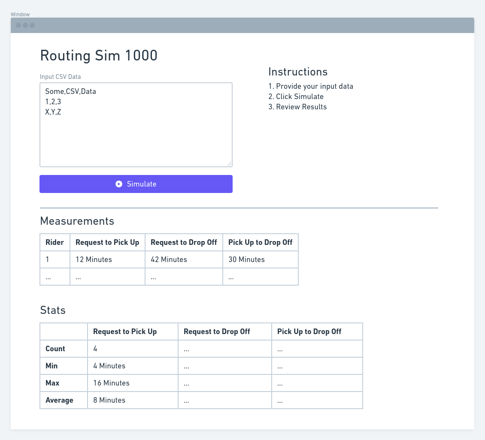

# Simple Sim

All API code is in `/api`.

Put all frontend code in `/web`.

## Objective

Create a single page app using React (see [web/README](./web/README.md))



## Resources

[Echo Server Docs](https://echo.labstack.com/)

## Requirements

- NodeJS
- Go 1.15
- Docker
- Docker Compose

## Commands

All commands written as running from the root of the repo.

### Check your work

We expect to be able to run docker compose to start everything.

In terminal 1:

```bash
docker-compose up --build
```

In terminal 2:

```bash
curl http://127.0.0.1:1323/ping
"pong"
```

```bash
curl --data-binary @input.csv http://127.0.0.1:1323/sim
{ ... sim results ...}
```

In a browser the web app should be running in development mode:

http://127.0.0.1:3000/

### Run Go tests

```bash
go test -v ./api/...
```

### Run local server without docker / docker-compose

```bash
go run ./api/cmd/api/...
```
